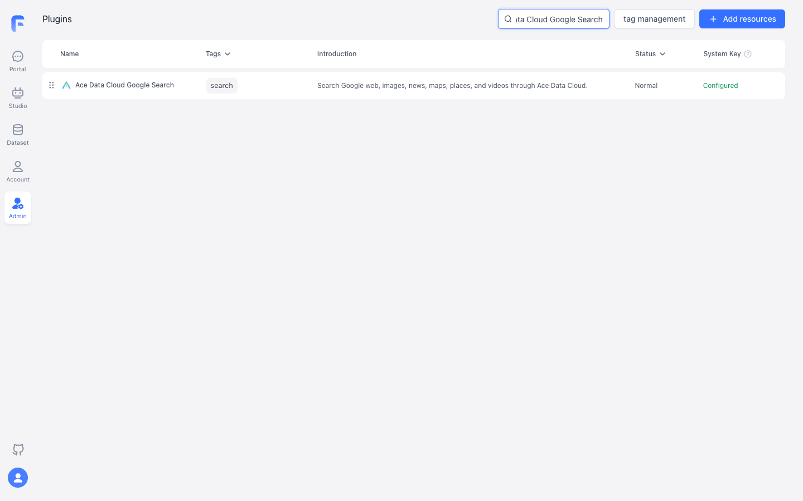
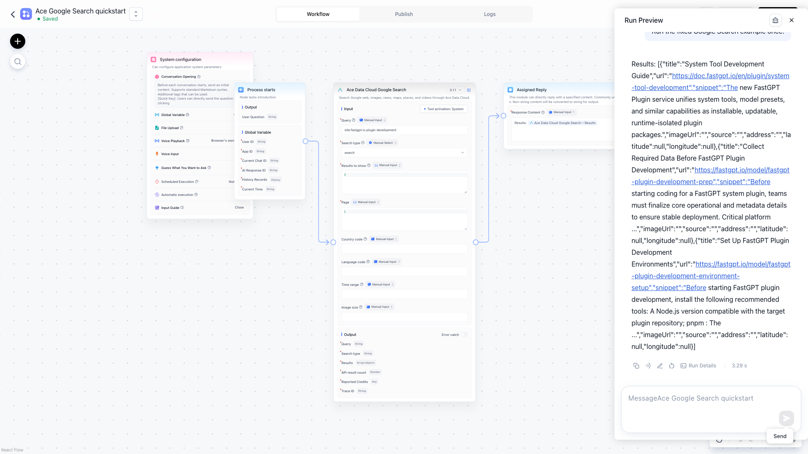

# Ace Data Cloud 谷歌搜索工具 for FastGPT

[English guide](README.md) · [当前价格](https://platform.acedata.cloud/models)

本插件在 FastGPT 中提供网页、图片、新闻、地图、地点和视频六种谷歌搜索。一次调用同步返回结果，无任务 ID，也无需轮询。

## 从零开始

1. 使用 FastGPT 4.15 或更新版本及本插件 0.1.1 或更新版本。插件上架后在 FastGPT 插件市场搜索 **Ace Data Cloud Google Search**，核对作者为 **Ace Data Cloud** 再安装。上架前，企业版或自部署管理员可以构建本仓库 .pkg 并在插件管理页上传；FastGPT 云服务目前不支持用户直接上传自定义插件。
2. 登录 [Ace Data Cloud 应用管理](https://platform.acedata.cloud/console/applications)，打开 **General Application**，确认已开通 Google Search、余额与当期价格。点击下图 **1** 复制 API Key；如需为 FastGPT 单独建密钥，选择 **2 Manage Keys → Create**。若启用 Allowed APIs，加入 /serp/google。

3. 在 FastGPT 已安装插件的配置中，将密钥填入 **Ace Data Cloud API key**。只填令牌本身，不加 Bearer、引号或空格；不要放进提示词或工作流导出。
4. 在 **Studio → Create Agent → Workflow** 新建工作流。从 **System Tools** 添加 **Ace Data Cloud Google Search**，激活工具并选择已配置的 **System secret**，连接 **Process starts → Ace Data Cloud Google Search → Basic / Assigned Reply**。工具参数：Query 为 site:fastgpt.io plugin development，Search type 为 search，Results to show 为 3，Page 为 1，其余留空。在 **Assigned Reply** 中用变量选择器插入工具的 items、returnedCount、costCredits 与 traceId。选择 **Save Only**，再用 **Run Preview** 执行一次。
5. 打开 items 中的链接；网页结果包括标题、URL 和摘要。到 Ace Data Cloud 控制台核对这次请求与 Credits 扣费。部分搜索类型的 API 可能返回多于请求数量的条目，插件最多展示 Results to show 条，并单独给出 API 实际返回数量。

以下截图展示插件安装，以及 **FastGPT Run Preview 中一次新调用**的结果。

## 无密钥示例与其他类型

[examples/search.json](examples/search.json) 不含密钥。将真实密钥写入本地 .secrets.local.json，内容为 {"apiKey":"YOUR_OWN_KEY"}，然后运行：

~~~sh
pnpm install
pnpm exec fastgpt-plugin debug . --run --input-file examples/search.json --secrets-file .secrets.local.json
pnpm exec fastgpt-plugin build --entry . --output ./dist
pnpm exec fastgpt-plugin check --entry . --output ./dist
pnpm exec fastgpt-plugin pack --entry . --dist ./dist --output ./out
~~~

密钥文件已由 Git 忽略。不要提交或截图。Search type 也可选择 images、news、maps、places、videos。图片结果请用 imageUrl 的原图，不要用小缩略图；Image size 只用于图片搜索，Time range 只用于网页和新闻。国家、语言是可选的本地化参数。每次调用都会单独计费。

| 情况 | 处理 |
|---|---|
| 401 / 403 | 检查密钥有效期、服务权限、Allowed APIs 和余额。 |
| 400 | 检查查询词、类型、分页与类型专属筛选参数。 |
| 无结果 | 改用更宽的查询词或地区/语言。 |
| 429 | 等待并降低并发。 |
| 超时 / 5xx | 先查原请求记录再重试不确定的付费搜索；只给客服 traceId，不给密钥。 |

插件仅向 api.acedata.cloud 发送所选查询、筛选参数和令牌。费用以[当前服务价格](https://platform.acedata.cloud/models)为准。[隐私说明](PRIVACY.md) · [源码与问题反馈](https://github.com/AceDataCloud/GoogleSearchFastGPT/issues)。
